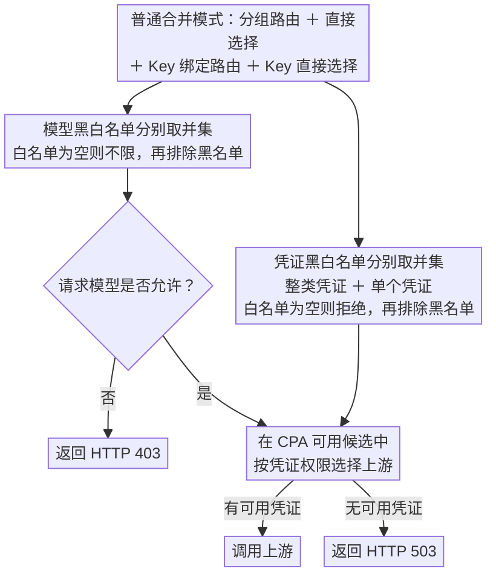

<div align="center">
  <h1>API Key 团队管理</h1>
  <p><strong><a href="https://github.com/router-for-me/CLIProxyAPI">CLIProxyAPI</a> 团队权限、账号、计费与 Codex Turn State 管理插件。</strong></p>
  <p>
    <a href="https://github.com/CHIMOOO/cpa-plugin-key-billing-manager/releases/latest"></a>
    <a href="https://github.com/CHIMOOO/cpa-plugin-key-billing-manager/actions/workflows/check.yml"></a>
    
    <a href="./LICENSE"></a>
  </p>
  <p><strong>简体中文</strong> · <a href="./README.en.md">English</a></p>
</div>

**插件 ID：`cpa-team-manager` · 商店名称：API Key 团队管理 · 发布仓库：[CHIMOOO/cpa-plugin-key-billing-manager](https://github.com/CHIMOOO/cpa-plugin-key-billing-manager)**

这是基于 [haowang02/cpa-plugin-key-billing](https://github.com/haowang02/cpa-plugin-key-billing) 开发的独立 fork：在下游 API Key 计费、订阅与路由能力之上，加入团队分组、账号接入与并发、订阅额度查询、风控和 Codex Turn State。保留原作者 MIT 版权声明；本项目的 `v0.0.x` 发布版本与原项目版本分别维护。

[安装与启用](#安装与启用) · [旧版本迁移](#从本项目-v007-及更早版本迁移) · [账号接入](#账号接入用量与并发) · [Codex Turn State](#codex-turn-state) · [更新记录](Changelog.md)

## 功能导航

| 页面 | 可以做什么 |
| --- | --- |
| API Key / API Key 分组 | 配置 Key 并发、模型与账号权限；普通/唯一/通用号池；分组与账号独立开关，绑定账号紧凑展示 |
| 订阅计划 | 设置金额、Token、请求数限额；按全部模型、指定模型或模型类别划分额度池；支持独立与统一重置周期 |
| 账号接入 | 接入 OpenCode Go / Zen、CommandCode、Cline Pass，发布支持的模型并查询上游实际提供的订阅额度 |
| 账号管理 | 查看逐账号请求、成功/失败、Token、费用与当前并发；设置逐账号并发上限 |
| Codex Turn State | 按账号与模型采集、续期和注入模板；有效桶保护；静态/轮换代理、10 并发连通性检测、可选自动淘汰 |
| 模型测试 | 单次诊断、原创提示词预设与响应对比；显示明确的代理路径，不执行生成代码 |
| 风控中心 | 本地关键词与模型范围规则、观察/请求前拒绝、命中内容哈希记忆；不保存提示词正文 |
| 分析 / 请求事件 / 错误事件 | 查看宿主上报的用量、费用、时延与失败；不从响应正文推算计费 |
| 设置 | 配置路由、模型价格和长上下文阶梯价；查看日志和必要的持久化风险提示 |

支持简体中文和英文。独立页面可切换语言；嵌入 CPAMC / CPAMP 时跟随管理面板语言。普通 API Key 持有者可通过独立查询页查看自己的订阅与用量。

## 安装与启用

### 环境要求

- 使用带插件支持的 CLIProxyAPI（CPA）**7.2.143 或更高版本**，不支持 no-plugin 构建。
- **使用 Codex Turn State 时推荐 CPA 7.3.4 或具有相同请求头转发修复的版本，并使用 HTTP/SSE。** 7.2.143 的 Codex 执行器会丢弃该请求头；仅看插件注入计数不能证明上游收到了模板。受保护账号关闭上游 WebSocket 后，客户端可通过 CPA 的 HTTP/SSE 桥接继续使用 WebSocket。
- 发布包覆盖 Windows、macOS、Linux 的 amd64 / arm64。插件探测使用 Go 内置 HTTP 客户端，CPA 环境无需额外安装 `curl`。
- 本项目 v0.0.7 及更早版本的用户，请先执行下方的旧 ID 迁移步骤，避免新建数据库后误以为原数据丢失。

### 推荐：把本项目添加为第三方插件源

插件源地址（添加 **Raw registry URL**，不是仓库主页）：

```text
https://raw.githubusercontent.com/CHIMOOO/cpa-plugin-key-billing-manager/main/registry.json
```

1. 使用管理密钥登录 CPA 管理面板，进入配置编辑页面。当前面板的入口如下：

   | 管理面板 | 填写插件源的位置 |
   | --- | --- |
   | CLI Proxy API Management Center（CPAMC） | **配置面板 → 可视化 → 高级与实验 → 插件 → 第三方插件源**，填写「插件源 registry URL」 |
   | CPA Manager Plus（CPAMP） | **配置面板 / 配置文件 → 可视化 → 系统配置 → 插件商店来源**，每行一个地址 |

2. 追加上面的 URL，保留已有插件源，开启「启用插件系统」，然后保存配置。
3. 打开 **插件商店**并刷新，搜索 `cpa-team-manager` 或「API Key 团队管理」。核对作者为 **CHIMOOO**、仓库为本项目，选择需要的已发布版本并安装。
4. 在 **插件 / 已安装插件** 中确认该插件已启用，按下节配置 `state_file`；插件总开关和单插件开关都需要启用。按面板提示重启实际运行 CPA 的服务或容器，不能仅刷新浏览器。
5. 在插件提供的菜单或页面资源中打开 **API Key 团队管理**，核对页脚版本。若菜单未出现，可使用下方的直接访问地址。

以上输入位置已按 [CPAMC 配置实现](https://github.com/router-for-me/Cli-Proxy-API-Management-Center/blob/main/src/features/config/components/sections/SectionAdvanced.tsx) 和 [CPAMP 配置实现](https://github.com/seakee/CPA-Manager-Plus/blob/main/apps/web/src/components/config/VisualConfigEditor.tsx) 核对；面板版本不同，名称或位置可能略有差异。旧版界面没有对应输入框时，可在已有 `config.yaml` 的 `plugins` 下合并以下配置，不要覆盖其他插件设置：

```yaml
plugins:
  enabled: true
  store-sources:
    - https://raw.githubusercontent.com/CHIMOOO/cpa-plugin-key-billing-manager/main/registry.json
```

内置官方源由宿主保留；添加本项目源不需要等待官方收录。`registry.json` 提供发布信息，不会编译工作区代码；安装依赖本仓库已发布的 GitHub Release 产物。源码构建方法见文末。CPAMP 的插件重启与资源路径说明可参阅[官方插件手册](https://github.com/seakee/CPA-Manager-Plus/blob/main/apps/docs/manual/plugins.md)。

### 手动安装

停止 CPA，在其工作目录运行安装脚本。Linux / macOS：

```sh
curl -LsSf https://raw.githubusercontent.com/CHIMOOO/cpa-plugin-key-billing-manager/main/install.sh | sh
```

Windows PowerShell：

```powershell
irm https://raw.githubusercontent.com/CHIMOOO/cpa-plugin-key-billing-manager/main/install.ps1 | iex
```

脚本把本项目发布的动态库放到当前目录的 `plugins/`。也可以从 [Releases](https://github.com/CHIMOOO/cpa-plugin-key-billing-manager/releases/latest) 下载对应操作系统和架构的包，使用同一 Release 的 `checksums.txt` 校验后解压：

```text
plugins/cpa-team-manager.so       # Linux
plugins/cpa-team-manager.dylib    # macOS
plugins/cpa-team-manager.dll      # Windows
```

若配置了其他 `plugins.dir`，应放入实际加载目录。保存插件配置后启动 CPA；升级动态库后也需要重启。不要在根目录及平台子目录同时留下同一插件 ID 的多份库。

### 从本项目 v0.0.7 及更早版本迁移

本项目从 **v0.0.8** 起将插件 ID、配置键、动态库文件名与访问地址由 `cpa-key-billing` 改为 `cpa-team-manager`，与原项目区分。迁移步骤针对本 fork 的旧版本，不代表任意原项目版本都可直接互换。

1. **停止 CPA 并备份**：保存 `config.yaml`、原 `state_file` 数据库及旁边的 `.turn-state.json`；若已有 `.account-runtime.json`、`.risk-control.json`，也一并备份。
2. 将本 fork 的旧 `cpa-key-billing.so` / `.dylib` / `.dll` 移出插件加载目录，不要同时加载旧、新两份计费与调度插件。
3. 将 `plugins.configs` 中本项目的配置键改为 `cpa-team-manager`，**保留原 `state_file` 完整路径**，例如 `plugins/cpa-key-billing-state-v1.db`。不需要重命名数据库或旁边的状态文件。新 ID 默认使用新路径，省略旧路径不会自动接管原数据。
4. 安装新动态库，启动 CPA，在新地址核对原分组、订阅、用量和桶。账号指纹保持兼容，已有绑定无需重新选择。

同一个 CPA 实例只应启用一份负责这些计费、调度和限制的插件。不同插件不得共同打开同一数据库。回退时先停止 CPA，恢复升级前的数据库、状态文件和对应旧版配置，再启动旧插件。

## 配置

在 CLIProxyAPI 配置文件中加入：

```yaml
plugins:
  enabled: true
  dir: "plugins"
  configs:
    cpa-team-manager:
      enabled: true
      debug: false # 是否记录 debug 日志，例如路由日志、匹配参考价日志
      codex_fast_mode_billing: false # 开启后，Codex 的 priority 请求按 2.5 倍计费
      state_file: "plugins/cpa-team-manager-state-v1.db"
```

`codex_fast_mode_billing` 开启后，请求 Codex 上游时在请求中指定 `service_tier=priority`，按普通费用的 **2.5 倍**结算。

升级兼容性由数据格式决定，不能把原项目的版本号当成本 fork 的版本号。当前代码使用 SQLite 格式 v20，新增分组号池属性；受支持且结构完整的 v10–v19 数据库会保留数据并迁移到 v20，已有分组默认为普通。更早的 JSON 文件、未知或不兼容的 SQLite 格式不承诺自动迁移，遇到错误请保留备份并使用新的 `state_file`，不要强改数据库版本。旧版插件不能直接打开升级后的数据库；回退时恢复备份。

备份应在 CPA 停止后进行，并包含：

| 文件 | 保存内容 |
| --- | --- |
| `state_file` 指定的 SQLite 数据库 | Key、分组号池属性、订阅计划、计费与用量历史 |
| `<state_file>.turn-state.json` | 代理、采集设置及运行快照基线 |
| `<state_file>.turn-state.json.runtime.json` | 最新持久化模板与冷却记录；必须和基线文件一起备份 |
| `<state_file>.turn-state-runner.json` | 服务器采集开启状态；进程重启后按此恢复 |
| `<state_file>.account-runtime.json` | 逐账号并发与有效桶保护设置 |
| `<state_file>.risk-control.json` | 风控规则、事件与哈希记忆 |
| CPA 配置及 `auth-dir` | 上游通道、接入账号凭证与未完成的凭证迁移 |

重启 CLIProxyAPI 后，在管理中心打开「API Key 团队管理」。确认模型定价后，创建订阅计划并绑定需要限制的 API Key。

## 页面访问

管理员可以从 CLIProxyAPI 管理中心的「API Key 团队管理」菜单进入，也可以直接打开：

```text
http(s)://<CLIProxyAPI 地址>/v0/resource/plugins/cpa-team-manager/ui
```

普通用户使用自己的 API Key 查询订阅额度和用量时，直接打开：

```text
http(s)://<CLIProxyAPI 地址>/v0/resource/plugins/cpa-team-manager/ui#account
```

### 持久化提示

「设置」页会检查可识别的 Linux 容器部署中，插件库、计费数据库和插件数据文件所在的挂载位置。仅检测到容器可写层、内存文件系统或已加载但磁盘缺失的插件库等风险时显示提示及需处理的路径；已检测到正常外部挂载的状态不展示，其他页面不展示此模块。容器重建可能丢失可写层文件；这与普通 CPA 进程重启不同。插件库或数据丢失后，分组与额度限制可能不再生效。

请备份数据，为插件和数据目录配置持久挂载，并在部署配置中保留插件加载项。CPA 没有向插件开放安全修改容器挂载的能力，因此这里提供具体提示，不提供无法保证生效的“一键设置”。检测到外部挂载只证明当前路径的挂载状态，不保证自动加载、未来部署或备份正确；无法检测的部署不显示推断结论。

## 计费与订阅规则

- 未绑定订阅计划的 API Key 只统计用量，不限制额度。
- 订阅计划可设置多个自定义额度窗口，每个窗口可单独或组合限制金额、Token、请求数。
- 每个额度池可覆盖全部模型、指定的一个或多个模型，或 OpenAI、Claude、xAI、Gemini、DeepSeek、Qwen 模型类别。多个模型放在同一池时共用该池额度；想分别限制时创建不同的池，重置周期可以相同。例如 `gpt-6-astra` 每天 100 美元、`gpt-5.5` 每天 200 美元，互不占用余额。
- 类别按请求中的模型名称识别，例如 OpenAI 对应 GPT/o 系列、xAI 对应 Grok；CPA 的兼容接口名称不是模型类别。任意自定义别名应使用完整模型 ID 配置指定模型额度。未命中这些范围的模型只受「全部模型」额度及路由限制；没有全部模型池时，不受其他模型池的限制。
- 一个请求命中多个池时，各池同时累计和限制，例如同时设置全部模型 500 美元与 Claude 200 美元。费用记录仍只记一次；Claude 额度用尽不会阻止其他未耗尽的模型池。修改范围会重置该池用量，单纯调整限额保留已用量。
- 含模型范围额度池的计划要求请求指定具体模型。动态 `auto`（包括思考后缀）在 CPA 的准入与用量记录中可能对应不同模型，无法可靠归属时会返回 `503 quota_model_unresolved`，避免漏扣额度；只有全部模型额度池的计划继续支持 `auto`。
- 每个 API Key 独立记账。独立周期从首次放行开始；统一周期可为各窗口指定下次开始时间，所有绑定 Key 按固定时间重置。
- 手动重置额度时，统一周期的重置时间保持不变；独立周期在下一次放行时重新开始。
- 自定义价优先于 models.dev 参考价；两者都没有时正常放行，记录用量但费用为零。Token 和请求次数额度仍然生效，未定价用量不会扣除金额额度。
- 请求事件保留最近 365 天。

## 路由规则

在 API Key 页面绑定路由规则，也可在「API Key 分组」页通过分组授权：创建分组时可以绑定路由规则，也可以不建路由、直接选择允许的认证文件、配置凭证或模型，两者可同时使用；再把 Key 加入一个或多个组。API Key 可批量设置多个分组，分组成员列表支持搜索和按现有分组筛选。

点击整条模型或账号选项，可依次在未选择、允许、禁用之间切换，无需打开状态下拉框；键盘 Enter / Space 同样可用。「高级：动态整组规则」和「绑定 API Key」默认展开。没有启用的唯一组时，分组绑定的路由、分组的直接选择、Key 直接绑定的路由和 Key 的直接选择共同合并：白名单取并集，黑名单取并集，黑名单优先。模型白名单为空时不限制模型；**受路由或分组管理的 Key，凭证白名单为空时不允许任何上游**。只有选中的凭证可以使用。普通合并模式下，Key 与有效分组合并后的凭证白名单为空才禁止访问；唯一模式下，显式清空 Key 的直接凭证配置会禁止访问。选择整类凭证会授权该类别当前和未来新增的凭证；只允许指定认证文件时，应逐个选择文件，不选择整类凭证。既未绑定路由规则、也未直接选择凭证或模型的空组不授予权限；只有按号池属性筛选后的有效分组都为空组时，请求才会返回“API Key 所属分组尚未绑定路由规则或上游凭证，访问已被禁止”。

「API Key 分组」页中的**启用访问控制**默认开启，保存后刷新页面或重启 CPA 都会保留。关闭后暂停分组、模型与凭证访问限制，CPA 自身认证及插件的计费、额度和并发限制仍然生效。**拒绝所有未分组的apikey**默认关闭；开启并保存后，所有未分组 Key（包括后续新建的 Key）都不能访问模型。关闭时，没有任何分组或路由限制的 Key 可使用 CPA 提供的上游。

每个分组都有独立启用开关。禁用后保留成员与规则，但不参与模型、凭证的授权或拒绝；Key 只有禁用组时拒绝访问，同时属于其他启用组时按这些组继续授权。升级后的已有分组默认启用。

同一个 Key 属于多个启用组时，先按号池属性选出参与的组、合并其授权，再从 CPA 对当前模型提供的候选中选择可用账号。某个组绑定了停用账号，不会阻止另一个组的可用候选被选择；账号重新启用后按宿主的最新状态恢复参与调度。分组授权不会重新启用账号，也不会绕过零权重、模型冷却或其他组的黑名单。没有可用且获授权的候选时拒绝请求，不会退到未授权账号。

分组编辑器的「号池属性」提供三种选择：

| 属性 | 对绑定 Key 的作用 |
| --- | --- |
| 普通（默认） | 没有启用的唯一组时照常参与；存在唯一组时不参与授权或拒绝 |
| 唯一 | 当前 Key 的号池只来自这个组和它已绑定的启用通用组 |
| 通用 | 可与唯一组共同提供号池；只有显式绑定本组的 Key 可使用，不是对全部 Key 开放 |

例如 Key A 同时绑定组 1 和组 2：组 1 设为唯一、组 2 为普通时，只使用组 1；将组 2 改为通用后，两组的可用账号都可参与调度。两个组都为普通时保持原有合并规则。

每个 Key 最多绑定一个启用的唯一组；新建、编辑、启用或批量绑定产生冲突时，整次操作会被拒绝，保留已有设置。禁用唯一组后，其余启用组按普通合并规则恢复参与。启用唯一组时，Key 单独配置的凭证白名单与「唯一＋通用」号池取交集，模型白名单同样取交集，拒绝项仍优先；单 Key 的规则不能扩大该号池。Key 从未配置直接路由时继承两组号池；显式保存过直接配置后，只有直接规则或路由允许的凭证参与交集，空配置、仅模型或仅拒绝列表都不会授予凭证。访问控制关闭时，这些分组限制也暂停。

分组中的「绑定账号」改为紧凑卡片，不再查询或展示上游额度。开关直接修改 CPA 账号状态，对全部绑定该账号的分组生效，停用后不再接收新请求。物理认证文件和可核验的原生 API Key 使用宿主逐账号接口；原生 API Key 通过增删 `excluded-models: ["*"]` 切换，保留其他排除项。权重为 0 与账号停用分开显示，启用不会改权重。OpenAI 兼容通道和虚拟子账号没有可靠的同等逐账号接口时，开关会明确不可用，请到原管理页处理；不会暗中禁用整个通道。

原 X-Forwarded-For 拦截功能和管理接口已移除；旧数据库中的设置仅为兼容保留，不再影响请求。

凭证选择器默认显示全部，Codex、xAI 分类包含对应服务商的配置凭证及 OAuth 认证文件；OAuth 按认证文件来源筛选。搜索和分类只改变显示范围，不清除已选项。批量选择仅作用于当前显示的单个凭证；需要授权未来新增凭证时，单独选择“整类”。API Key 只显示脱敏值：足够长时显示首尾各 8 个字符，短 Key 按长度缩减，4 个字符只显示首尾各 1 个字符。

升级前已有的仅模型或仅拒绝列表路由也遵循凭证白名单规则，需明确选择允许凭证后才能继续访问。

插件在调度时筛选凭证，并在 CPA 选出最终凭证后核对白名单。CPA 提供的候选范围仍受其优先级设置影响；若其他调度模式跳过插件调度，最终检查会拒绝未授权凭证，不会自行改选。按整类授权时，无法从宿主提供的目录确认凭证类别会拒绝访问，可改为明确选择单个凭证。



## 账号接入、用量与并发

「账号接入」支持 OpenCode Go / Zen、CommandCode API Key 和 Cline Pass。Cline 可通过设备授权登录，或填写已有凭证；登录与刷新由当前页面发起。凭证保存在 CPA 的认证文件中，插件数据库不保存这些明文凭证。请同时持久化并备份 CPA 的 `auth-dir` 和上游配置。

保存账号后，将选中的模型发布到 CPA 上游。OpenCode 按已验证的模型协议自动生成 Chat Completions、Responses 和 Anthropic 通道；原生通道的客户端模型名带独立前缀，页面可复制。当前宿主无法配置 OpenCode Google 模型所需的接口路径，目录中未确认协议的模型也不发布；界面会列出原因。发布和删除只更新该账号所属通道，失败时保留重试入口；多类通道分别写入，部分成功会明确显示。

替换密钥或手动刷新 Cline 凭证时，先迁移准确的分组、路由和 Key 凭证引用，并让新旧凭证共用并发上限，再发布上游配置。全部通道确认更新后移除旧引用。操作中断时使用「连接 / 修复通道」继续，重试不会再次轮换凭证；待迁移记录保存在 CPA 认证目录中。取消设备登录会停止后续通道写入；若账号已保存，页面会明确告知，可在账号卡片中删除。

若上游已轮换凭证而 CPA 认证目录写入失败，新凭证只暂存在进程内存中；应先恢复存储并修复通道。此时若进程退出，可能需要重新登录。

| 接入类型 | 额度来源与显示 |
| --- | --- |
| OpenCode Go | 通过工作区 ID 和控制台 auth cookie 读取服务端订阅用量窗口 |
| OpenCode Zen | 可接入和发布模型；当前不查询预付费余额 |
| CommandCode | 官方 CLI 使用的组织订阅额度与余额接口 |
| Cline Pass | 官方订阅用量接口；仅发布该订阅可用的模型 |

额度按需刷新，只显示上游实际返回的窗口、比例或余额。未返回的 5 小时/周额度不补造，查询失败不显示为满额。分组号池不再请求或显示这些额度，额度查询保留在账号接入或认证文件页面。上游订阅额度和本插件的下游订阅限额分别计算。

「账号管理」按宿主明确提供的账号索引汇总最近 365 天的 `usage.handle` 记录，展示请求数、成功/失败、可归类 Token、费用和并发。旧记录缺失的 Token 分类不能补回，会标记不完整记录。部分 CPA 版本不在认证清单中列出配置型 API Key：这些账号仍可预先设置并发，但用量需要首次请求确认准确身份；重启后可能需再次确认，不会将未知用量显示为零。

逐账号并发上限为 0–1000，0 表示不限。它与下游 API Key 并发同时生效：流式请求持续占位，结束、断开或切换重试账号时释放原账号槽位。设置保存在 `<state_file>.account-runtime.json`，备份时一并保留。

## 模型测试

「模型测试」用于对比选定账号、模型对同一提示词的单次响应。它通过 **CPA 的管理接口发起诊断请求**，不经过完整的下游 API Key 业务链路，因此不能代替 Key 分组、路由与订阅额度的业务验收。测试会消耗上游额度；该调用路径不产生 `usage.handle`，不会写入下游用量与计费记录，页面也不把响应中的数字当作可靠的 Token、费用或 TTFT 指标。

模型测试需要 **CPA 7.3.4 兼容宿主及 Schema 6**。当前支持可精确确认身份的 **Codex OAuth 认证文件**，以及 CPA 原生配置中的 **OpenAI 兼容、Codex / Responses、Claude 和 Gemini API Key 通道**。配置型账号通过当次读取的原生管理配置、账号索引和精确指纹匹配；部分旧宿主不会把这些账号列入认证文件清单，因此不依赖该清单作为唯一来源。其他类型的 OAuth 文件（例如 Claude、Antigravity）、停用账号、缺少或重复的账号索引，以及未支持的自定义请求头或协议会明确拒绝测试。账号接入模块发布的通道也需满足这些条件，不会直接使用保存凭证的辅助记录发请求。

1. 在左侧账号栏按 **Codex、Claude、Gemini、OpenAI 兼容或其他服务商**筛选，也可搜索账号并多选。「选择当前筛选」只选择当前可见且可测试的账号；切换分类或搜索不会清除已选项。禁用、不支持或身份不明确的账号不可选择。一批最多 50 个账号，窄屏时账号栏显示在测试设置上方。
2. 填写这批账号要测试的实际上游模型 ID。同一批使用同一模型名和提示词；配置型通道提供模型/别名候选，每项执行前重新读取其配置并解析别名。选择不同服务商时，应先确认它们支持该模型名，或分批测试。
3. 选择预制提示词并阅读验收标准与来源。**精确 JSON、约束推理、糖果保证、布尔表达式和交换追踪**使用明确的答案检查；**鹈鹕 SVG、代码审查及自定义提问**由人工比较。编辑预设提示词后自动按自定义提问处理，不套用原题断言。提示词上限为 8192 UTF-8 字节。
4. 点击批量测试，按账号列表顺序逐个账号执行；单项失败继续下一个，每项只请求一次，不自动重试。可查看已完成/总数和每项结果，点击停止或离开模型测试页后不再开始待执行项，已经发送的一项仍会收尾。批量任务由当前管理页面执行，刷新、退出登录或关闭页面不会在服务器上继续这份队列。
5. 页面内存保留当前批次至多 50 条结果，开始新批次会替换旧结果，可手动清除。每项展示自己的模型、代理通路、回答和判定；原始响应不会生成用量或计费记录。断言通过只说明本题的答案与格式符合要求，不能证明真实模型身份或整体能力，建议固定模型名与提示词，对照已知正常账号重复比较。

预制题来源与使用方式：

| 题目 | 来源与本项目处理 | 判断重点 |
| --- | --- | --- |
| 经典鹈鹕测试（“醍醐”） | [Simon Willison 原文](https://simonwillison.net/2024/Oct/25/pelicans-on-a-bicycle/)中的“鹈鹕骑自行车”，本项目重述并增加静态 SVG 约束 | 人工看长喙、喉囊、自行车结构和骑乘关系；没有唯一标准图 |
| 糖果保证问题 | [codex-candy-eval 社区题](https://github.com/haowang02/codex-candy-eval/blob/main/codex_candy_eval.py)，重写题干并明确可按形状挑选 | 最少 21 颗：圆形 9、星形 12；严格检查三个 JSON 字段，不能只因出现“21”就算通过 |
| 布尔表达式 | 参考 [BIG-bench Boolean Expressions](https://github.com/google/BIG-bench/tree/main/bigbench/benchmark_tasks/boolean_expressions) 的题型，本项目独立编写表达式 | 运算优先级、嵌套否定和布尔值类型 |
| 交换追踪 | 参考 [BIG-bench Tracking Shuffled Objects](https://github.com/google/BIG-bench/tree/main/bigbench/benchmark_tasks/tracking_shuffled_objects) 的题型，本项目独立编写交换序列 | 连续跟踪对象归属，检查全部五个结果 |

这些是小型诊断题及改编题，不是官方 BIG-bench 跑分，也没有经验证的“降智阈值”。熟悉的固定题可能被模型记住；应结合多类题目和人工审查，不使用模型自报的名称、知识截止日期、juice 或回答长短判定身份与质量。SVG 仅以受限静态图像预览，禁止脚本、外部资源、内嵌网页和动画；同时保留原始回答文本。回答中的代码不会执行。

每项模型测试结果另行展示「填写模型」「发送模型（已解析别名）」和「上游声明的响应模型」。声明取自该次响应的协议字段：Responses 的 `response.model` / JSON `model`、Chat Completions / Claude 的 `model`、Gemini 的 `modelVersion`。名称不同仅提示核对别名或版本；缺失明确显示未取得，同次 SSE 出现互相冲突的声明会标记冲突，不沿用上一条测试结果，也不从回答正文猜模型。该信息仅用于诊断，不改变计费、路由或题目判分。

**网络路径明确指定：账号代理 → 全局代理 → 显式直连。** 账号明确配置直连时会覆盖全局代理。每次执行都重新核对配置，页面展示实际选用的来源及脱敏端点；无法核对全局配置、代理配置非法或连接失败时，测试不会悄悄改为直连。

插件为这次诊断执行本地风控、有效 State 检查与逐账号并发保护。准备结果只能在短时间内发送；过期时需要重新测试，避免使用即将失效的模板。正常完成会释放占位；管理连接中断时无法证明上游已停止，占位会保守保留至本次有限租期结束，在后续宿主调用中清理。服务器不为测试创建后台循环。

普通状态查询 API 不返回原始 State。管理员准备单次模型测试时，临时响应可能包含该次请求需要的 State 头，页面仅用于本次调用，不将它、完整代理凭证或 API Key 写入测试历史。原始响应只用于提取和展示模型文本，不用于构造业务计费或失败事件。

## 风控中心

风控默认关闭，支持按模型范围检查本地关键词。观察模式只记录命中；请求前拦截模式在调用上游前拒绝命中内容。拦截模式下无法检查的请求正文也会拒绝，包括缺失、格式不支持或超过检查上限的正文；当前检查最多 1 MiB JSON 和 64 KiB 可识别文本，不分析图片、音频或外部链接内容。

可记住命中内容的哈希，之后相同规范化文本也按策略处理。事件只保存时间、模型、规则与调用方引用，不保存请求正文、摘录或凭证。事件默认保留 30 天、最多 500 条，计数反映当前保留的事件；哈希记忆可单独清除。配置、事件和哈希保存在 `<state_file>.risk-control.json`。该功能是本地规则检查，不提供外部 AI 内容审核或对上游账号封禁风险的保证。

## Codex Turn State

相关项目 [NanSsye/ccodex-sleep-state-r14](https://github.com/NanSsye/ccodex-sleep-state-r14) 是 gylive 项目的分支。来源关系、r14–r16 近期更新和本插件的适用性评估见 [State 相关项目审查](docs/state-upstream-review-2026-09-20.md)。

自动采集需要同时安装新版插件和独立的[服务器采集器](deploy/README.state-collector.md)，支持 systemd 与 Docker 常驻。v0.0.9 的页面驱动模式不会自动升级成后台任务；只更新插件库而没有安装采集器时，页面会显示离线，不会用浏览器兜底探测。

在独立的「Codex Turn State」页中配置。该模块源自 [arden-aaai/cpa-plugin-codex-turn-state](https://github.com/arden-aaai/cpa-plugin-codex-turn-state)（MIT License，Copyright © 2026 boooot），在其账号/模型模板算法、注入模式和代理重试规则基础上适配本插件的同步调用与独立状态存储。原项目出处、参考版本及完整许可证见 [THIRD_PARTY_NOTICES.md](THIRD_PARTY_NOTICES.md)。默认关闭；启用后设置即时生效，修改模式不需要重启 CPA。替换插件动态库仍需重启。

HTTP/SSE 业务注入要求 CPA `7.3.4` 或具有相同修复的版本。旧版 `7.2.143` 的 Codex 执行器不转发该请求头；设置开关和插件注入计数不能检测这个宿主限制。升级宿主后再验证实际请求行为。

**加入采集列表的账号默认启用业务保护**：只允许使用该账号、实际模型对应的有效模板。桶缺失或过期、注入关闭、观察模式以及 `replace-only` 无法替换当前请求时，均拒绝业务流量；其他账号仍按自身规则调度。该保护独立于采集开关，在页面顶部单独保存。切换为 `always` 可处理不携带模板的客户端请求，但仍需先有有效桶。旧宿主或缺少所选账号信息时会保守拒绝；宿主提供的 schema 6 是最低兼容标记，不能证明任意分支包含请求头转发修复。

**客户端 WS 接入可以保留，受保护账号使用上游 HTTP/SSE。** 保存采集设置或开始探测时，页面通过 CPA 已有的逐账号接口关闭所选账号的上游 WebSocket（`websockets=false`），回读核验后才继续。不会改变账号启用状态、OAuth 凭证或全局代理。移出采集范围不会自动重新打开其上游 WS。

CPA 在上游 WS 关闭时，把客户端每轮 WS 请求桥接为 HTTP/SSE，因此每轮都能注入当前模板。插件对受保护的下游 WS 请求通过本地宿主回调核验账号身份和上游模式；未知身份、无法核验或上游 WS 被重新开启时仍拒绝，避免把复用上游 WS 当作逐轮注入成功。切换前已经建立的会话可能需要重连一次；外部并发修改账号配置不属于原子切换保证。真实 CPA v7.3.8 的同一条下游 WS 两轮请求已验证通过，第二轮使用了新模板。

关闭上游 WS 失败时保留采集草稿、不提交新 State 设置；已成功改为 HTTP 的账号保持该设置，重试可继续完成。关闭有效桶保护仍是独立操作，页面会要求确认。

| 设置 | 行为 |
| --- | --- |
| `replace-only`（默认） | 仅在请求头长度等于替换长度（默认 312）时注入有效模板 |
| `always` | 有匹配的有效模板时注入，包括请求未携带该头的情况 |
| 观察模式 `dry_run` | 记录决策，但不修改业务请求头 |
| 响应学习 | 合格响应头先写内存缓存；管理状态同步或探测时再落盘，响应不等待磁盘 |
| 默认探测模型 | `gpt-6-astra`、`gpt-5.6-sol`；与旧默认值完全一致的列表会自动纠正，自定义或清空的列表保留 |
| 模板长度 / 替换长度 | 默认 292 / 312，可按实际协议调整 |
| 有效期 | 从令牌内嵌时间戳计算，默认 3600 秒；重复采集不会延长令牌寿命 |

### 第一次使用怎么操作

1. **选账号和模型。** 在「采集范围」勾选需要保护的 Codex OAuth 账号，填写实际要用的模型。账号需有有效登录凭证、模型权限和可用额度；State 不会补充已耗尽的账号额度。
2. **配置并检测代理。** 一行一个完整代理 URL，固定出口填静态池，每次连接更换出口的填轮换池。「测试连通性」最多同时检测 10 条；检测通过只说明本次网络可达，还需要采集有效桶。
3. **设置业务注入。** 启用 Turn State，关闭「仅观察」。客户端不发送 State 请求头时选择 `always`；使用 `replace-only` 时，客户端必须发送可替换的头。使用 CPA 7.3.4 兼容版本，上游走 HTTP/SSE、客户端可走 WS；默认有效桶保护会拒绝未就绪账号的业务请求。
4. **安装采集器，保存再开始。** 按[部署说明](deploy/README.state-collector.md)在 CPA 服务器安装独立采集器，确认在线。点击「保存所有设置」，核验所选账号的上游 WS 已关闭后，再点击「开始」。开启状态保存在服务器，刷新、离开页面、退出管理登录或关闭本机都不会停止。临时网络、CPA 重启或管理认证错误会退避重试；修复地址或采集器使用的管理密码后可恢复。点击页面「停止」才关闭自动采集意图。
5. **检查结果再使用。** 「桶就绪度」中目标账号和模型的剩余分钟数大于 0，且日志显示采集成功，才表示获得了有效模板。然后通过这台 CPA 发请求，查看业务决策的补入/替换记录；这不等于对回答质量的保证。账号和模型必须与所采桶一致。

日志中长度 312 的「状态不合格」表示没有保存有效桶；会按出口池规则尝试其他代理或等待冷却。「模板仍有效」「账号等待中」「采集等待中」表示任务在等待，并非停止。采集由服务器上的独立进程驱动，页面关闭、离开或本机休眠只影响状态展示。若页面显示采集器离线，请检查独立服务及其管理密码；仅打开网页不会代替服务发起探测。

### 自动淘汰代理

「丢弃异常 IP」和「丢弃不合格 IP」**默认关闭**。前者针对已确认的代理连接、超时或代理认证失败，后者针对采到降级长度的状态。账号 401/403/429、缺少账号凭证等情况不会按坏代理删除。

勾选任一选项后设置「最少保留代理数」，默认 10，范围 1–40000，按静态池和轮换池的条目总数计算。到达下限后继续探测，但不再删除；不会自动删空并改用直连。删除按该次使用的完整 URL 和所在池精确匹配，多个会话共用同一网关不会被一起删除。轮换池删除的是该 URL 入口，不代表永久封禁某个实际出口 IP。

自动淘汰会立即保存，并在日志中显示删除结果与剩余数量；保存失败会保留代理并继续探测。文本框会同步最新池，有未保存编辑时保留草稿并提示重新加载。它与连通性检测后的「删除无效代理」不同：后者只编辑草稿，仍需点击保存。开启淘汰前可先复制列表留存。

### 账号与模板

模板严格按 CPA 选中的账号和实际上游模型隔离。`always` 不会生成模板，也不会跨账号、模型使用；`pass` 可能表示请求已经带着当前模板，应结合界面中的具体原因判断。响应头长度是该第三方项目的识别规则，不代表对模型回答质量的独立验证。

安装独立服务器采集器后，选择探测账号、填写模型并点击开始，即可关闭页面持续采集。**已停用的 Codex OAuth 账号也可以选中并采集**，列表会标注停用状态；采集不会启用账号，日常业务仍遵守 CPA 的停用设置。账号需要有效的 OAuth 凭证；过期凭证需重新登录或由 CPA 刷新。已删除或不再是 Codex OAuth 的账号不参与探测，已保存的失效选择可在页面中移除。静态代理一行对应一个固定出口，同一账号/模型失败后冷却 55 分钟；每个账号、模型的整个轮换池在 10 分钟窗口内共享最多 10 次探测机会，增加 URL 不会放大失败重试预算；成功后按模板续采时间重新开启预算。临期有效桶优先续采，同类桶轮流分配机会；每连续 3 次临期续采会为缺失桶保留一次机会，避免前面的坏桶让其他桶一直等待。成功后按模板实际签发时间和有效期安排续采。提前续采可设置为 10、20 等整数分钟，必须小于模板有效期；`renew_before_minutes=0` 保留自动策略：提前 5 分钟，短有效期则提前有效期的四分之一。调整该设置会重新安排成功出口的续采，不重置失败出口的冷却。升级前保存的旧冷却没有成功标记，会先按原期限结束一次。

提前续采按旧模板的真实到期时间倒推，不等待过期。例如模板 11:00 到期，设置提前 20 分钟会从 10:40 开始进入续采队列；设置提前 10 分钟则为 10:50。续采期间业务继续使用尚未过期的旧模板，取得更新且合格的模板并完成持久化后再切换。失败、不合格或旧令牌不会提前清空当前模板，也不会延长其原到期时间。已有业务请求不会被采集器主动中断。

表格分别显示「剩余有效分钟数」和「距离续采窗口」，进入窗口后标明等待采集，正在采集且旧模板仍有效时显示「续采中 · 旧模板仍可用」。这里显示的是进入续采队列的时间，不是承诺请求恰好在该秒发出。大量账号排队、25 秒网络超时、代理失败或上游 429/401 冷却可能耗尽提前量；账号较多或代理不稳定时建议提前 10–20 分钟。过短 TTL 的自动提前量也可能小于进程重启的 90 秒租约接管时间，不能保证不断档，更不能让过期模板继续被标成可用。

### 严格探测与小时预算

「严格探测：确认上游响应完成」默认关闭，以保持旧版本只读取响应头的行为。开启后，主动探测必须在原有 25 秒总超时内确认 SSE 的 `response.completed` 或 JSON 的 `status=completed`，才继续按 State 长度与真实签发时间判断是否保存。解码后的响应最多读取 1 MiB，支持 HTTP 客户端正常解压 gzip；不支持的内容编码（例如 zstd）会明确失败，不假装验证通过。失败、截断、缺少完成标志、非法格式或超限均不保存新模板，旧模板到期前继续有效；这种校验失败不会把代理误判为连接异常而自动丢弃。只读取主动探测的响应，不让业务请求等待完整流或重建计费。可能增加探测耗时与输出消耗，仍不能证明回答质量。

「每小时采集上限」默认 **0（不限）**，可设置 1–10000；它是所有账号、模型、两池及直连、自动与手动探测共用的滚动一小时预算（自检和模型测试不计入该采集预算，但仍可能消耗上游额度），原有账号暂停和出口重试规则仍生效。每次探测在读取凭证及发送请求前原子持久化预留一次，预留后即使取凭证失败、连接失败或严格校验失败也会计入；预留写入失败则不发请求、不扣数。预算用完显示已用、剩余和恢复倒计时，采集器继续在线等待，不清空有效模板。

保存设置、重启 CPA、清空模板或清冷却都不会重置账本；不限模式也记录最近一小时，随后开启限额时会计入。减小上限可能需要等待多条历史预约到期；同秒预约合并可能保守延迟不足一秒释放。账本随 State 基线和运行快照备份。预算过小可能使多个桶来不及续采，不能保证不断档；旧版本尚未记账的历史请求无法补算，首次升级从现有可用账本开始。

### 图片接口与 State 隔离

CPA 明确标记为 `/v1/images/generations` 或 `/v1/images/edits` 的请求，不要求聊天 State 模板，也不主动注入或从其响应学习聊天 State，避免生图、改图因缺少聊天模板被误拦。分组、模型白名单、账号启用状态、额度及并发控制继续生效；图片响应不会覆盖已有聊天模板。未知路径以及普通 `/responses` 中的 `image_generation` 工具仍按原 State 规则处理，不按模型名字猜测请求类型。

本修复仅针对插件自身的 State 隔离。CPA 是否支持该图片模型、上传转发、请求超时、上游权限和图片额度仍由宿主及上游决定；本插件没有增加独立图片网关，也没有把图片等待时间改成十分钟。

### 表格、日志与自检

采集表格按「账号 × 模型」展示，单元格显示剩余有效分钟数，包含未采集的桶及范围外仍有效的模板。采集账号与代理默认展开，已保存代理会完整加载到文本框。支持带账号密码的 HTTP、HTTPS、SOCKS5、SOCKS5H URL；只提交有修改的池，把已加载的文本框内容删空并保存会清空对应池。状态接口仅返回代理数量和配置修订标识，不返回完整列表；完整代理通过管理员专用接口分页读取，并禁止缓存。

账号、模型、代理、注入和续采策略统一显示未保存状态，各区块和页面顶部均提供「保存所有设置」，失败时保留草稿。桶就绪度直接展示采集代理的 IP/主机及端口，认证信息仍隐藏；轮换代理网关地址不等于当次真实出口 IP。

总览分别展示探测结果、桶就绪度和业务决策计数，包括替换、补入、直通、跳过、观察模式及错误。计数从本次插件加载起计算，页面刷新不会清零。停止自动采集并等待在途请求收尾后，每个桶可手动定向采集或通过 CPA 发起自测；模板与冷却管理仍按页面可用操作执行。自测固定该账号和模型，发送一条不携带模板的最小请求，用于检查 CPA 调用路径；不会采集模板，也不证明注入效果或回答质量。

HTTP 401、403 或 429 会暂停该账号全部模型的采集 10 分钟；401/403 不再沿用旧版的 55 分钟暂停。403 可能来自账号权限，也可能来自出口限制，单看状态码不能断定账号失效。只要账号仍在暂停，即使池里还有数百条未尝试的代理，也会显示「账号等待中」。静态出口失败冷却按账号与模型分别计算，为 55 分钟；轮换池每个账号与模型在 10 分钟窗口内共用 10 次机会，增加 URL 不会扩大这个预算。日志保留 HTTP 状态码，并在等待时显示下次调度检查时间；这不是所有冷却的到期时间，也不保证该时刻一定发出请求。

账号暂停时长与参考项目的 [10 分钟定义](https://github.com/arden-aaai/cpa-plugin-codex-turn-state/blob/13573a6c86449d1cab3f76ed9e1ae5511bcbb4aa/go/probe_runner.go#L174-L180)及 [401/403/429 处理](https://github.com/arden-aaai/cpa-plugin-codex-turn-state/blob/13573a6c86449d1cab3f76ed9e1ae5511bcbb4aa/go/probe_runner.go#L667-L680)对齐。升级前已保存的 55 分钟暂停不会自动缩短，因为旧记录没有保留暂停原因；需要提前重新检查时，可手动清除一次冷却。

「清除冷却」需要二次确认，只移除失败冷却，保留有效模板、正常续采等待与小时预算。已开启且在线的采集器会在下一次心跳重新检查，通常在 5 秒内，不再等待清除前缓存的一分钟检查时间；如有在途请求，需先等它完成。已停止的任务保持停止，模板尚未进入续采窗口或小时预算已耗尽时仍会等待。重试会消耗上游额度、代理流量，并可能再次触发限流；清除不会解除上游自身的限制。单桶操作同时清除该账号共享的账号级暂停，确认弹窗会说明影响。

### 代理检测与大列表保存

每个池可单独测试连通性，显示进度、代理地址和可取得的出口 IP。测试不使用账号凭证、不消耗账号额度，连接 Codex 接口验证可达性；连接失败或代理认证失败才可批量删除，上游 403、429 或无法确定的结果会保留。「删除无效代理」先修改文本框，点击保存才生效。采集日志和实时进度显示当前代理序号/总数、完整配置地址（含代理用户名和密码），轮换池同时显示重试次数；这些内容仅通过管理员接口返回并禁止缓存。成功模板的持久化采集地址仍隐藏认证信息。代理地址与实际出口 IP 不一定相同，轮换代理的检测出口仅代表该次检测，不能证明后续采集使用相同 IP。

探测按静态池、轮换池的列表顺序组成一个循环，两池共用一个跨账号、模型的游标。每次开始探测后移到下一条，采集成功后下一个桶也接着使用下一条，走完再回到开头；只有一条可用代理时会循环使用它。当前桶的静态出口冷却、轮换池预算耗尽或成功续采等待仍会跳过；成功不会删除该代理。游标随运行快照保存，刷新页面和重启 CPA 后可以继续；编辑或自动丢弃代理后优先从原顺序中下一条仍存在的代理继续。轮换规则只决定使用哪条入口 URL，不能保证供应商分配不同公网 IP。

静态池和轮换池各支持最多 20,000 条代理，完整配置上限为 16 MiB。管理页保存大配置时自动分块上传，每次请求约 16 KiB，避免大量代理一次性提交触发常见网关的 `413 Request Entity Too Large`。全部上传并校验通过后才一次性生效；中途失败保留现有配置和页面草稿，可直接重试。加载代理后或上传期间若其他页面修改了配置，本次代理提交会被拒绝；请使用重新加载按钮取得最新列表后重新编辑、保存。未完成上传仅保留在内存，15 分钟无活动后在后续调用中清理，不写入状态文件。

### 运行与保存边界

探测使用 Go 内置 HTTP 客户端，无需服务器安装 `curl`。每次管理请求同步完成一次探测，总超时为 25 秒；每次新建连接，读取响应头后关闭响应和连接，避免轮换代理因连接复用而继续使用同一出口。探测使用选定账号直接请求 Codex，不修改 CPA 的账号启用状态或全局代理；**会消耗上游额度，直连探测不计入 CPA 下游 API Key 的计费记录**。连续任务由独立的 `cpa-state-collector` 进程定时唤醒。插件只在宿主调用内同步处理探测，不在内部启动后台任务。浏览器只读服务器状态并提交启停意图；关闭页面和退出登录不会停止服务器任务。停止后不再开始新探测，在途的一次请求可以收尾。租约和在途检查保证重复采集器不会并发探测；自动运行时旧浏览器或手动探测入口会被拒绝。保存配置和清空模板仍会与在途探测协调。WebSocket 握手响应头不在当前 HTTP/SSE 学习接口中；可先通过探测取得模板。

服务器采集开关保存在 `<state_file>.turn-state-runner.json`，重启后恢复；租约和最近至多 100 条采集事件（编码后合计最多 1 MiB，超出时先移除最旧事件）仅保留在当前 CPA 进程内，重启清空最近日志不会删除模板。设置、代理及基线快照保存在计费数据库旁的 `<state_file>.turn-state.json`；最新模板与冷却记录保存到较小的 `<state_file>.turn-state.json.runtime.json`。配置保存会原子更换基线，运行快照只对匹配的基线生效；停止 CPA 后必须一起备份和恢复这两个文件。

探测成功会立即持久化。业务响应学到的新模板先在内存中生效，在后续管理状态同步、采集器同步或探测保存时落盘；这段时间异常退出或重启可能丢失新学习的缓存，可重新采集。持久化失败保留缓存并在 State 页提示重试。磁盘保存和大池扫描不再持有业务共用锁；插件按宿主能力协商流式协议，新宿主不再为每个片段复制无用历史窗口。文件限制为当前系统用户可读写；普通状态查询 API 不返回原始模板；管理员专用代理读取接口会返回完整代理 URL（含密码），供文本框编辑。管理员状态中的采集日志和实时进度返回完整代理 URL（含密码），与编辑器一致；采集器进程的系统日志不输出这些代理地址。集成模块与独立 turn-state 插件应选择其一启用，避免两个模块先后改写同一请求头。

## 拦截请求的响应

以下 `type` / `code` 按 OpenAI 兼容响应列出；原生 Anthropic 格式使用对应的错误封装。

| 场景 | 状态码 | `type` | `code` |
| --- | --- | --- | --- |
| API Key 并发已满 | `429` | `rate_limit_error` | `rate_limit_exceeded` |
| 订阅额度用尽 | `429` | `rate_limit_error` | `rate_limit_exceeded` |
| 模型无权访问 | `403` | `permission_error` | `insufficient_quota` |
| 未分组默认拒绝、所属分组均禁用或为空组、最终凭证未授权 | `403` | `permission_error` | `access_denied` |
| 没有符合规则且可用的凭证 | `503` | `server_error` | `internal_server_error` |
| 已绑定的路由规则不存在或损坏 | `503` | `server_error` | `routing_configuration_error` |
| 逐账号并发已满 | `429` | `rate_limit_error` | `rate_limit_exceeded` |
| 受保护账号缺少可注入的有效模板 | `503` | `cpa_key_billing_error` | `turn_state_required` |
| State 保护宿主不兼容 / WebSocket 不支持 | `503` | `cpa_key_billing_error` | `turn_state_host_unsupported` / `turn_state_websocket_unsupported` |
| 模型范围额度无法归属动态模型 | `503` | `cpa_key_billing_error` | `quota_model_unresolved` |
| 风控规则拒绝 | 默认 `403`，可配置 4xx | `permission_error` | `content_policy_violation` |

部分错误类型保留 `cpa_key_billing_error` 以兼容现有客户端，不代表加载了旧插件 ID。

通过 WebSocket 调用 `/v1/responses`（如 Codex CLI 的 WebSocket 传输）时，CPA 遇到插件拦截会直接关闭连接，客户端收不到上表的状态码和提示语，通常表现为连接断开后重试。

## 实现边界与开发

用量、计费、时延和上游失败信息均来自 CPA 的 `usage.handle`，不解析业务响应正文重建用量。请求前检查负责准入，调度与最终账号检查负责上游授权、逐账号并发和有效模板保护；请求完成事件只负责释放并发等生命周期工作。

插件在宿主调用内同步完成工作，不创建自己的后台协程、定时器或刷新任务。连续采集、额度刷新与账号授权轮询由管理页面驱动；页面关闭后，服务器不会自行继续这些循环。正常业务请求的已保存计费、权限与 State 规则仍在 CPA 中生效。

### 本地构建与调试

仓库根目录的 `registry.json` 使用 CPA 插件商店 schema v1，插件 ID 为 `cpa-team-manager`，仓库指向本项目。可把对应分支的 Raw URL 添加到 CPA 的插件商店源。商店安装依赖该仓库的 GitHub Release 构建产物；`registry.json` 本身不会编译或加载本地代码。

调试尚未发布的修改时，安装 Go 1.24+ 和 C 编译器，在本仓库根目录编译动态库。Windows PowerShell（需要 MinGW-w64 GCC）示例：

```powershell
$env:CGO_ENABLED = "1"
New-Item -ItemType Directory -Force dist | Out-Null
go build -buildvcs=false -tags cshared -buildmode=c-shared -o dist/cpa-team-manager.dll ./cmd/cpa-key-billing
```

Linux 使用：

```sh
mkdir -p dist
CGO_ENABLED=1 go build -buildvcs=false -tags cshared -buildmode=c-shared -o dist/cpa-team-manager.so ./cmd/cpa-key-billing
```

停止 CPA，将对应平台的动态库复制到其 `plugins/` 目录，按上文配置启用插件后重启。避免在根目录和平台子目录同时保留相同 ID 的旧版插件。打开 `/v0/resource/plugins/cpa-team-manager/ui` 即可调试；UI 嵌入动态库，每次修改后都需要重新编译并重启 CPA。测试时建议使用独立的 CPA 配置、数据库和虚拟 Key。

## 许可证与来源

本项目使用 [MIT License](LICENSE)，保留原作者 **Hao Wang** 的版权与许可声明。第三方集成的参考版本与许可证见 [THIRD_PARTY_NOTICES.md](THIRD_PARTY_NOTICES.md)。

- [haowang02/cpa-plugin-key-billing](https://github.com/haowang02/cpa-plugin-key-billing) - 本仓库 fork 的原项目；已适配合入上游 v1.3.12 的中英文支持（[594c3b1](https://github.com/haowang02/cpa-plugin-key-billing/commit/594c3b1922edb6ce38058b4b1dc2707023ed0cf3)），保留本分支的分组授权与 Codex Turn State 扩展
- [cpa-plugin-codex-turn-state](https://github.com/arden-aaai/cpa-plugin-codex-turn-state) - 集成的 Codex Turn State 模板采集与注入功能来源
- [LINUX DO](https://linux.do/) - 新的理想型社区
