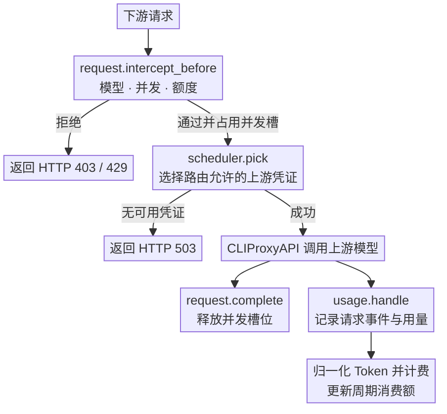
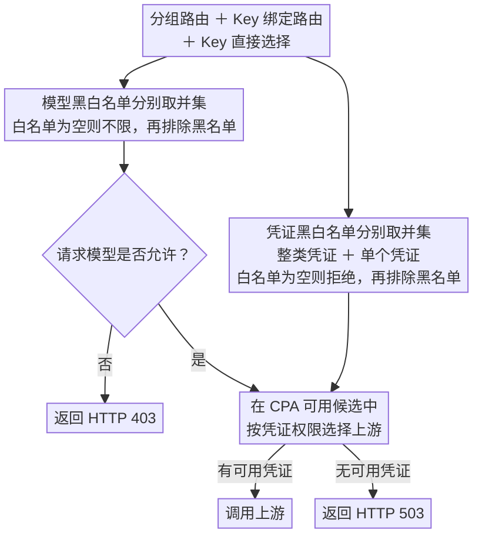

<div align="center">
  <h1>CPA Key Billing</h1>
  <p><strong><a href="https://github.com/router-for-me/CLIProxyAPI">CLIProxyAPI</a> 下游 API Key 管理与订阅额度插件。</strong></p>
  <p>
    <a href="https://github.com/haowang02/cpa-plugin-key-billing/releases/latest"></a>
    <a href="https://github.com/haowang02/cpa-plugin-key-billing/actions/workflows/check.yml"></a>
    
    <a href="./LICENSE"></a>
  </p>
</div>


## 功能特性

- 支持金额、Token、请求三种额度，可按 API Key 独立计时或按订阅计划统一周期重置
- 支持按输入 Token 阈值切换长上下文**阶梯计价**
- 支持按 API Key 设置**最大并发请求数**
- 支持为每个 API Key 绑定**路由规则**，限制模型访问范围和上游凭证
- 支持 API Key 加入多个分组，按组绑定路由规则，批量设置成员与凭证白名单
- 支持全局访问控制开关，以及可选的未分组 Key 默认拒绝策略
- 可从 [models.dev](https://models.dev/) 获取模型参考价

## 工作原理

插件会在请求到达上游前检查订阅额度、并发和路由。上游调用结束后，CLIProxyAPI 通过 `usage.handle` 提供用量。插件据此记录请求事件、计算费用并更新周期消费额。



性能方面，插件以同步 RPC 方法接入 CLIProxyAPI 的请求链路。请求准入与凭证调度仅执行本地状态查询和规则计算，不进行网络 I/O，也不复制或解析上游响应；用量记录与计费则在上游调用结束后通过 `usage.handle` 完成。插件不创建后台协程、定时器或异步刷新任务，整体资源占用较少；请求链路上的额外开销仅来自轻量的本地判断，对请求延迟几乎没有影响。

## 环境要求

- CLIProxyAPI `7.2.143` 或更高版本，建议使用最新版本
- 使用支持插件的 CLIProxyAPI 构建，不要使用 no-plugin 版本

## 安装

本分支新增功能请按下文「在 CPA 中调试本地修改」编译加载，或通过本仓库的 `registry.json` 安装本仓库发布的构建。以下原始安装脚本下载的是上游发行版。

在 CLIProxyAPI 根目录运行。macOS 和 Linux 使用：

```sh
curl -LsSf https://raw.githubusercontent.com/haowang02/cpa-plugin-key-billing/main/install.sh | sh
```

Windows 请先停止 CLIProxyAPI，再在 PowerShell 中运行：

```powershell
irm https://raw.githubusercontent.com/haowang02/cpa-plugin-key-billing/main/install.ps1 | iex
```

安装脚本会将插件安装到当前目录的 `plugins/`。安装或升级完成后需要重启 CLIProxyAPI。

也可以从 [Releases](../../releases/latest) 下载对应平台的发布包，解压后将动态库放入 CLIProxyAPI 的 `plugins/` 目录：

```text
plugins/cpa-key-billing.so       # Linux
plugins/cpa-key-billing.dylib    # macOS
plugins/cpa-key-billing.dll      # Windows
```

## 配置

在 CLIProxyAPI 配置文件中加入：

```yaml
plugins:
  enabled: true
  dir: "plugins"
  configs:
    cpa-key-billing:
      enabled: true
      debug: false # 是否记录 debug 日志，例如路由日志、匹配参考价日志
      codex_fast_mode_billing: false # 开启后，Codex 的 priority 请求按 2.5 倍计费
      state_file: "plugins/cpa-key-billing-state-v1.db"
```

`codex_fast_mode_billing` 开启后，请求 Codex 上游时在请求中指定 `service_tier=priority`，按普通费用的 **2.5 倍**结算。

> [!WARNING]
> 升级前请备份数据文件。
>
> - v1.0.0 至最新版本的数据库文件支持自动迁移。
> - v0.8.4 及更早版本的 JSON 或 SQLite 数据文件不支持迁移，请将 `state_file` 指向新文件。

重启 CLIProxyAPI 后，在管理中心打开「API Key 管理」。确认模型定价后，创建订阅计划并绑定需要限制的 API Key。

## 页面访问

管理员可以从 CLIProxyAPI 管理中心的「API Key 管理」菜单进入，也可以直接打开：

```text
http(s)://<CLIProxyAPI 地址>/v0/resource/plugins/cpa-key-billing/ui
```

普通用户使用自己的 API Key 查询订阅额度和用量时，直接打开：

```text
http(s)://<CLIProxyAPI 地址>/v0/resource/plugins/cpa-key-billing/ui#account
```

## 计费与订阅规则

- 未绑定订阅计划的 API Key 只统计用量，不限制额度。
- 订阅计划可设置多个自定义额度窗口，每个窗口可单独或组合限制金额、Token、请求数。
- 每个 API Key 独立记账。独立周期从首次放行开始；统一周期可为各窗口指定下次开始时间，所有绑定 Key 按固定时间重置。
- 手动重置额度时，统一周期的重置时间保持不变；独立周期在下一次放行时重新开始。
- 自定义价优先于 models.dev 参考价；两者都没有时正常放行，记录用量但费用为零。Token 和请求次数额度仍然生效，未定价用量不会扣除金额额度。
- 请求事件保留最近 365 天。

## 路由规则

在 API Key 页面绑定路由规则，也可通过分组绑定：先创建路由并选择允许的认证文件或配置凭证，再创建分组并绑定路由，最后把 Key 加入一个或多个组。API Key 可批量设置多个分组，分组成员列表支持搜索和按现有分组筛选。

点击模型或凭证的选框，可在未选择、白名单（勾号）、黑名单（叉号）之间切换。所有组路由、Key 直接绑定的路由和直接选择共同合并：白名单取并集，黑名单取并集，黑名单优先。模型白名单为空时不限制模型；**受路由或分组管理的 Key，凭证白名单为空时不允许任何上游**。只有选中的凭证可以使用。保存 Key 的直接路由配置后，即使清空所有选项，仍表示禁止上游访问。选择整类凭证会授权该类别当前和未来新增的凭证；只允许指定认证文件时，应逐个选择文件，不选择整类凭证。未绑定路由的空组不授予权限。

**启用访问控制**默认开启，保存后刷新页面或重启 CPA 都会保留。关闭后暂停分组、模型与凭证访问限制，CPA 自身认证及插件的计费、额度和并发限制仍然生效。**默认拒绝未分组 Key**默认关闭；开启并保存后，所有未分组 Key（包括后续新建的 Key）都不能访问模型。关闭时，没有任何分组或路由限制的 Key 可使用 CPA 提供的上游。

凭证选择器提供 Codex、xAI、OAuth 分类和搜索；OAuth 按认证文件来源筛选。API Key 只显示脱敏值：足够长时显示首尾各 8 个字符，短 Key 按长度缩减，4 个字符只显示首尾各 1 个字符。

升级前已有的仅模型或仅拒绝列表路由也遵循凭证白名单规则，需明确选择允许凭证后才能继续访问。

插件在调度时筛选凭证，并在 CPA 选出最终凭证后核对白名单。CPA 提供的候选范围仍受其优先级设置影响；若其他调度模式跳过插件调度，最终检查会拒绝未授权凭证，不会自行改选。按整类授权时，无法从宿主提供的目录确认凭证类别会拒绝访问，可改为明确选择单个凭证。



## 拦截请求的响应

| 场景 | 状态码 | `type` | `code` |
| --- | --- | --- | --- |
| API Key 并发已满 | `429` | `rate_limit_error` | `rate_limit_exceeded` |
| 订阅额度用尽 | `429` | `rate_limit_error` | `rate_limit_exceeded` |
| 模型无权访问 | `403` | `permission_error` | `insufficient_quota` |
| 未分组默认拒绝、空组或最终凭证未授权 | `403` | `permission_error` | `access_denied` |
| 没有符合规则且可用的凭证 | `503` | `server_error` | `internal_server_error` |
| 已绑定的路由规则不存在或损坏 | `503` | `server_error` | `routing_configuration_error` |

## 在 CPA 中调试本地修改

仓库根目录的 `registry.json` 使用 CPA 插件商店 schema v1，插件 ID 保持 `cpa-key-billing`，仓库指向本项目。将文件提交到 GitHub 后，可把对应分支的 Raw URL 添加到 CPA 的插件商店源。商店安装依赖该仓库的 GitHub Release 构建产物；`registry.json` 本身不会编译或加载本地代码。

调试尚未发布的修改时，安装 Go 1.24+ 和 C 编译器，在本仓库根目录编译动态库。Windows PowerShell（需要 MinGW-w64 GCC）示例：

```powershell
$env:CGO_ENABLED = "1"
New-Item -ItemType Directory -Force dist | Out-Null
go build -buildvcs=false -tags cshared -buildmode=c-shared -o dist/cpa-key-billing.dll ./cmd/cpa-key-billing
```

Linux 使用：

```sh
mkdir -p dist
CGO_ENABLED=1 go build -buildvcs=false -tags cshared -buildmode=c-shared -o dist/cpa-key-billing.so ./cmd/cpa-key-billing
```

停止 CPA，将对应平台的动态库复制到其 `plugins/` 目录，按上文配置启用插件后重启。避免在根目录和平台子目录同时保留相同 ID 的旧版插件。打开 `/v0/resource/plugins/cpa-key-billing/ui` 即可调试；UI 嵌入动态库，每次修改后都需要重新编译并重启 CPA。测试时建议使用独立的 CPA 配置、数据库和虚拟 Key。

## 致谢

- [LINUX DO](https://linux.do/) - 新的理想型社区
