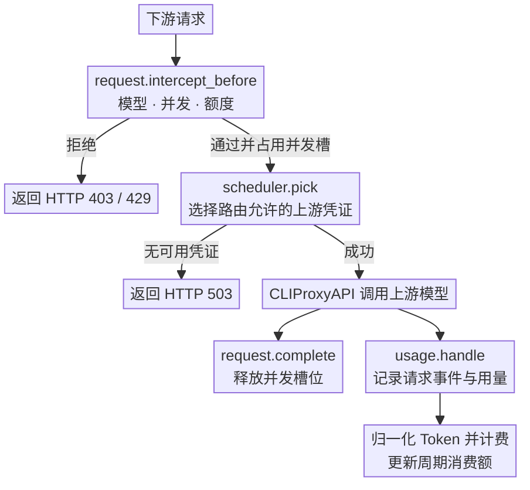
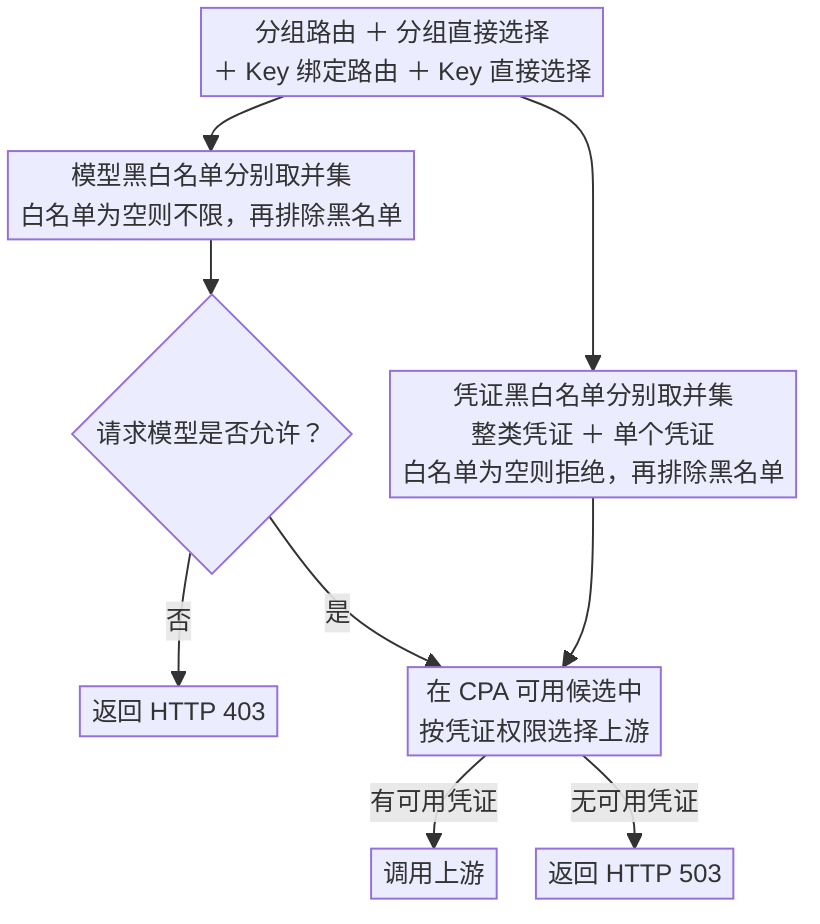

<div align="center">
  <h1>CPA Key Billing</h1>
  <p><strong><a href="https://github.com/router-for-me/CLIProxyAPI">CLIProxyAPI</a> 下游 API Key 管理与订阅额度插件。</strong></p>
  <p>
    <a href="https://github.com/CHIMOOO/cpa-plugin-key-billing-manager/releases/latest"></a>
    <a href="https://github.com/CHIMOOO/cpa-plugin-key-billing-manager/actions/workflows/check.yml"></a>
    
    <a href="./LICENSE"></a>
  </p>
  <p><strong>简体中文</strong> · <a href="./README.en.md">English</a></p>
</div>


## 功能特性

- 支持金额、Token、请求三种额度，可按 API Key 独立计时或按订阅计划统一周期重置
- 支持按输入 Token 阈值切换长上下文**阶梯计价**
- 支持按 API Key 设置**最大并发请求数**
- 支持为每个 API Key 绑定**路由规则**，限制模型访问范围和上游凭证
- 支持在独立的「API Key 分组」页中管理分组；API Key 可加入多个分组，按组绑定路由规则或直接选择上游凭证、模型，批量设置成员与凭证白名单
- 支持全局访问控制开关，以及可选的未分组 Key 默认拒绝策略
- 支持分组独立启停，禁用后保留成员与规则
- 集成 Codex turn-state 模板采集与注入，支持在独立的「Codex Turn State」页中切换 `replace-only` / `always` 和配置探测代理
- 可从 [models.dev](https://models.dev/) 获取模型参考价
- 支持简体中文与英文；独立页面可切换并记住语言，嵌入管理中心时跟随宿主语言

## 工作原理

插件会在请求到达上游前检查订阅额度、并发和路由。上游调用结束后，CLIProxyAPI 通过 `usage.handle` 提供用量。插件据此记录请求事件、计算费用并更新周期消费额。



插件以同步 RPC 方法接入 CLIProxyAPI。请求准入与凭证调度执行本地规则计算，用量记录与计费只依赖 `usage.handle`。启用 turn-state 后，会观察上游响应头并同步保存有效模板，不解析响应正文或据此重建计费。插件不创建后台协程、定时器或异步刷新任务；代理探测由管理页面逐次触发。

## 环境要求

- CLIProxyAPI `7.2.143` 或更高版本，建议使用最新版本
- Codex turn-state 的 HTTP/SSE 注入需要官方 `7.3.4` 或包含对应请求头转发修复的版本；`7.2.143` 的执行器会丢弃该头，插件显示注入决策也不能证明上游实际收到
- 使用支持插件的 CLIProxyAPI 构建，不要使用 no-plugin 版本

## 安装

本分支新增功能可按下文「在 CPA 中调试本地修改」编译加载，或通过本仓库的 `registry.json` 安装本仓库发布的构建。以下安装脚本下载本仓库的发行版。

在 CLIProxyAPI 根目录运行。macOS 和 Linux 使用：

```sh
curl -LsSf https://raw.githubusercontent.com/CHIMOOO/cpa-plugin-key-billing-manager/main/install.sh | sh
```

Windows 请先停止 CLIProxyAPI，再在 PowerShell 中运行：

```powershell
irm https://raw.githubusercontent.com/CHIMOOO/cpa-plugin-key-billing-manager/main/install.ps1 | iex
```

安装脚本会将插件安装到当前目录的 `plugins/`。安装或升级完成后需要重启 CLIProxyAPI。

也可以从 [Releases](../../releases/latest) 下载对应平台的发布包，解压后将动态库放入 CLIProxyAPI 的 `plugins/` 目录：

```text
plugins/cpa-key-billing.so       # Linux
plugins/cpa-key-billing.dylib    # macOS
plugins/cpa-key-billing.dll      # Windows
```

## 配置

在 CLIProxyAPI 配置文件中加入：

```yaml
plugins:
  enabled: true
  dir: "plugins"
  configs:
    cpa-key-billing:
      enabled: true
      debug: false # 是否记录 debug 日志，例如路由日志、匹配参考价日志
      codex_fast_mode_billing: false # 开启后，Codex 的 priority 请求按 2.5 倍计费
      state_file: "plugins/cpa-key-billing-state-v1.db"
```

`codex_fast_mode_billing` 开启后，请求 Codex 上游时在请求中指定 `service_tier=priority`，按普通费用的 **2.5 倍**结算。

> [!WARNING]
> 升级前请备份数据文件。
>
> - v1.0.0 至最新版本的数据库文件支持自动迁移。
> - v0.8.4 及更早版本的 JSON 或 SQLite 数据文件不支持迁移，请将 `state_file` 指向新文件。

重启 CLIProxyAPI 后，在管理中心打开「API Key 管理」。确认模型定价后，创建订阅计划并绑定需要限制的 API Key。

## 页面访问

管理员可以从 CLIProxyAPI 管理中心的「API Key 管理」菜单进入，也可以直接打开：

```text
http(s)://<CLIProxyAPI 地址>/v0/resource/plugins/cpa-key-billing/ui
```

普通用户使用自己的 API Key 查询订阅额度和用量时，直接打开：

```text
http(s)://<CLIProxyAPI 地址>/v0/resource/plugins/cpa-key-billing/ui#account
```

## 计费与订阅规则

- 未绑定订阅计划的 API Key 只统计用量，不限制额度。
- 订阅计划可设置多个自定义额度窗口，每个窗口可单独或组合限制金额、Token、请求数。
- 每个 API Key 独立记账。独立周期从首次放行开始；统一周期可为各窗口指定下次开始时间，所有绑定 Key 按固定时间重置。
- 手动重置额度时，统一周期的重置时间保持不变；独立周期在下一次放行时重新开始。
- 自定义价优先于 models.dev 参考价；两者都没有时正常放行，记录用量但费用为零。Token 和请求次数额度仍然生效，未定价用量不会扣除金额额度。
- 请求事件保留最近 365 天。

## 路由规则

在 API Key 页面绑定路由规则，也可在「API Key 分组」页通过分组授权：创建分组时可以绑定路由规则，也可以不建路由、直接选择允许的认证文件、配置凭证或模型，两者可同时使用；再把 Key 加入一个或多个组。API Key 可批量设置多个分组，分组成员列表支持搜索和按现有分组筛选。

点击模型或凭证的选框，可在未选择、白名单（勾号）、黑名单（叉号）之间切换。分组绑定的路由、分组的直接选择、Key 直接绑定的路由和 Key 的直接选择共同合并：白名单取并集，黑名单取并集，黑名单优先。模型白名单为空时不限制模型；**受路由或分组管理的 Key，凭证白名单为空时不允许任何上游**。只有选中的凭证可以使用。保存 Key 的直接路由配置后，即使清空所有选项，仍表示禁止上游访问。选择整类凭证会授权该类别当前和未来新增的凭证；只允许指定认证文件时，应逐个选择文件，不选择整类凭证。既未绑定路由规则、也未直接选择凭证或模型的空组不授予权限；只有 Key 所属的全部分组都是空组时，请求才会返回“API Key 所属分组尚未绑定路由规则或上游凭证，访问已被禁止”。

「API Key 分组」页中的**启用访问控制**默认开启，保存后刷新页面或重启 CPA 都会保留。关闭后暂停分组、模型与凭证访问限制，CPA 自身认证及插件的计费、额度和并发限制仍然生效。**拒绝所有未分组的apikey**默认关闭；开启并保存后，所有未分组 Key（包括后续新建的 Key）都不能访问模型。关闭时，没有任何分组或路由限制的 Key 可使用 CPA 提供的上游。

每个分组都有独立启用开关。禁用后保留成员与规则，但不参与模型、凭证的授权或拒绝；Key 只有禁用组时拒绝访问，同时属于其他启用组时按这些组继续授权。升级后的已有分组默认启用。

同一个 Key 属于多个启用组时，先合并这些组的授权，再从 CPA 对当前模型提供的候选中选择可用账号。某个组绑定了停用账号，不会阻止另一个组的可用候选被选择；账号重新启用后按宿主的最新状态恢复参与调度。分组授权不会重新启用账号，也不会绕过零权重、模型冷却或其他组的黑名单。没有可用且获授权的候选时拒绝请求，不会退到未授权账号。

原 X-Forwarded-For 拦截功能和管理接口已移除；旧数据库中的设置仅为兼容保留，不再影响请求。

凭证选择器默认显示全部，Codex、xAI 分类包含对应服务商的配置凭证及 OAuth 认证文件；OAuth 按认证文件来源筛选。搜索和分类只改变显示范围，不清除已选项。批量选择仅作用于当前显示的单个凭证；需要授权未来新增凭证时，单独选择“整类”。API Key 只显示脱敏值：足够长时显示首尾各 8 个字符，短 Key 按长度缩减，4 个字符只显示首尾各 1 个字符。

升级前已有的仅模型或仅拒绝列表路由也遵循凭证白名单规则，需明确选择允许凭证后才能继续访问。

插件在调度时筛选凭证，并在 CPA 选出最终凭证后核对白名单。CPA 提供的候选范围仍受其优先级设置影响；若其他调度模式跳过插件调度，最终检查会拒绝未授权凭证，不会自行改选。按整类授权时，无法从宿主提供的目录确认凭证类别会拒绝访问，可改为明确选择单个凭证。



## Codex Turn State

在独立的「Codex Turn State」页中配置。该模块源自 [arden-aaai/cpa-plugin-codex-turn-state](https://github.com/arden-aaai/cpa-plugin-codex-turn-state)（MIT License，Copyright © 2026 boooot），在其账号/模型模板算法、注入模式和代理重试规则基础上适配本插件的同步调用与独立状态存储。原项目出处、参考版本及完整许可证见 [THIRD_PARTY_NOTICES.md](THIRD_PARTY_NOTICES.md)。默认关闭；启用后设置即时生效，修改模式不需要重启 CPA。替换插件动态库仍需重启。

HTTP/SSE 业务注入要求 CPA `7.3.4` 或具有相同修复的版本。旧版 `7.2.143` 的 Codex 执行器不转发该请求头；设置开关和插件注入计数不能检测这个宿主限制。升级宿主后再验证实际请求行为。

| 设置 | 行为 |
| --- | --- |
| `replace-only`（默认） | 仅在请求头长度等于替换长度（默认 312）时注入有效模板 |
| `always` | 有匹配的有效模板时注入，包括请求未携带该头的情况 |
| 观察模式 `dry_run` | 记录决策，但不修改业务请求头 |
| 响应学习 | 从成功的 HTTP/SSE 响应头保存有效模板 |
| 默认探测模型 | `gpt6`、`gpt-5.6-sol`，可在页面按实际可用模型修改；已有保存的列表继续保留 |
| 模板长度 / 替换长度 | 默认 292 / 312，可按实际协议调整 |
| 有效期 | 从令牌内嵌时间戳计算，默认 3600 秒；重复采集不会延长令牌寿命 |

模板严格按 CPA 选中的账号和实际上游模型隔离。`always` 不会生成模板，也不会跨账号、模型使用；`pass` 可能表示请求已经带着当前模板，应结合界面中的具体原因判断。响应头长度是该第三方项目的识别规则，不代表对模型回答质量的独立验证。

选择探测账号、填写模型后，可开始探测并保持页面打开以连续采集。**已停用的 Codex OAuth 账号也可以选中并采集**，列表会标注停用状态；采集不会启用账号，日常业务仍遵守 CPA 的停用设置。账号需要有效的 OAuth 凭证；过期凭证需重新登录或由 CPA 刷新。已删除或不再是 Codex OAuth 的账号不参与探测，已保存的失效选择可在页面中移除。静态代理一行对应一个固定出口，同一账号/模型失败后冷却 55 分钟；轮换代理同一 URL 最多连续尝试 10 次，然后冷却 10 分钟。成功后按模板实际签发时间和有效期安排续采。提前续采可设置为 10、20 等整数分钟，必须小于模板有效期；`renew_before_minutes=0` 保留自动策略：提前 5 分钟，短有效期则提前有效期的四分之一。调整该设置会重新安排成功出口的续采，不重置失败出口的冷却。升级前保存的旧冷却没有成功标记，会先按原期限结束一次。

采集表格按「账号 × 模型」展示，单元格显示剩余有效分钟数，包含未采集的桶及范围外仍有效的模板。采集账号与代理默认展开，已保存代理会完整加载到文本框。支持带账号密码的 HTTP、HTTPS、SOCKS5、SOCKS5H URL；只提交有修改的池，把已加载的文本框内容删空并保存会清空对应池。状态接口仍只返回代理数量；完整代理通过管理员专用接口分页读取，并禁止缓存。

每个池可单独测试连通性，显示进度、代理地址和可取得的出口 IP。测试不使用账号凭证、不消耗账号额度，连接 Codex 接口验证可达性；连接失败或代理认证失败才可批量删除，上游 403、429 或无法确定的结果会保留。「删除无效代理」先修改文本框，点击保存才生效。采集日志和实时进度显示当前代理序号/总数、脱敏地址，轮换池同时显示重试次数；成功模板也保留脱敏采集地址。代理地址与实际出口 IP 不一定相同，轮换代理的检测出口仅代表该次检测，不能证明后续采集使用相同 IP。

静态池和轮换池各支持最多 20,000 条代理，完整配置上限为 16 MiB。管理页保存大配置时自动分块上传，每次请求约 16 KiB，避免大量代理一次性提交触发常见网关的 `413 Request Entity Too Large`。全部上传并校验通过后才一次性生效；中途失败保留现有配置和页面草稿，可直接重试。加载代理后或上传期间若其他页面修改了配置，本次代理提交会被拒绝；请使用重新加载按钮取得最新列表后重新编辑、保存。未完成上传仅保留在内存，15 分钟无活动后在后续调用中清理，不写入状态文件。

探测使用 Go 内置 HTTP 客户端，无需服务器安装 `curl`。每次管理请求同步完成一次探测，总超时为 25 秒；每次新建连接，读取响应头后关闭响应和连接，避免轮换代理因连接复用而继续使用同一出口。探测使用选定账号直接请求 Codex，不修改 CPA 的账号启用状态或全局代理；**会消耗上游额度，直连探测不计入 CPA 下游 API Key 的计费记录**。关闭页面或停止探测后不再发起下一轮，已经发出的那次请求会结束或超时。保存配置和清空模板会等待当前探测结束，避免旧结果覆盖新设置。WebSocket 握手响应头不在当前 HTTP/SSE 学习接口中；可先通过探测取得模板。

设置、代理和模板保存在计费数据库旁的 `<state_file>.turn-state.json`，备份时一并保存。文件限制为当前系统用户可读写；管理 API 不返回原始模板；管理员专用代理读取接口会返回完整代理 URL（含密码），供文本框编辑。普通状态与采集日志中的地址仍脱敏。集成模块与独立 turn-state 插件应选择其一启用，避免两个模块先后改写同一请求头。

## 拦截请求的响应

| 场景 | 状态码 | `type` | `code` |
| --- | --- | --- | --- |
| API Key 并发已满 | `429` | `rate_limit_error` | `rate_limit_exceeded` |
| 订阅额度用尽 | `429` | `rate_limit_error` | `rate_limit_exceeded` |
| 模型无权访问 | `403` | `permission_error` | `insufficient_quota` |
| 未分组默认拒绝、所属分组均禁用或为空组、最终凭证未授权 | `403` | `permission_error` | `access_denied` |
| 没有符合规则且可用的凭证 | `503` | `server_error` | `internal_server_error` |
| 已绑定的路由规则不存在或损坏 | `503` | `server_error` | `routing_configuration_error` |

通过 WebSocket 调用 `/v1/responses`（如 Codex CLI 的 WebSocket 传输）时，CPA 遇到插件拦截会直接关闭连接，客户端收不到上表的状态码和提示语，通常表现为连接断开后重试。

## 在 CPA 中调试本地修改

仓库根目录的 `registry.json` 使用 CPA 插件商店 schema v1，插件 ID 保持 `cpa-key-billing`，仓库指向本项目。将文件提交到 GitHub 后，可把对应分支的 Raw URL 添加到 CPA 的插件商店源。商店安装依赖该仓库的 GitHub Release 构建产物；`registry.json` 本身不会编译或加载本地代码。

调试尚未发布的修改时，安装 Go 1.24+ 和 C 编译器，在本仓库根目录编译动态库。Windows PowerShell（需要 MinGW-w64 GCC）示例：

```powershell
$env:CGO_ENABLED = "1"
New-Item -ItemType Directory -Force dist | Out-Null
go build -buildvcs=false -tags cshared -buildmode=c-shared -o dist/cpa-key-billing.dll ./cmd/cpa-key-billing
```

Linux 使用：

```sh
mkdir -p dist
CGO_ENABLED=1 go build -buildvcs=false -tags cshared -buildmode=c-shared -o dist/cpa-key-billing.so ./cmd/cpa-key-billing
```

停止 CPA，将对应平台的动态库复制到其 `plugins/` 目录，按上文配置启用插件后重启。避免在根目录和平台子目录同时保留相同 ID 的旧版插件。打开 `/v0/resource/plugins/cpa-key-billing/ui` 即可调试；UI 嵌入动态库，每次修改后都需要重新编译并重启 CPA。测试时建议使用独立的 CPA 配置、数据库和虚拟 Key。

## 致谢

- [haowang02/cpa-plugin-key-billing](https://github.com/haowang02/cpa-plugin-key-billing) - 本仓库 fork 的原项目；已适配合入上游 v1.3.12 的中英文支持（[594c3b1](https://github.com/haowang02/cpa-plugin-key-billing/commit/594c3b1922edb6ce38058b4b1dc2707023ed0cf3)），保留本分支的分组授权与 Codex Turn State 扩展
- [cpa-plugin-codex-turn-state](https://github.com/arden-aaai/cpa-plugin-codex-turn-state) - 集成的 Codex Turn State 模板采集与注入功能来源
- [LINUX DO](https://linux.do/) - 新的理想型社区
